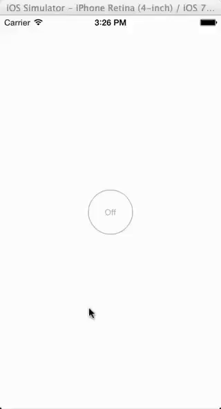

# MAMLSpringView

## Usage

To run the example project; clone the repo, and run `pod install` from the Example directory first.

To use in your project - drag a UIView onto your storybord and set the following runtime attributes: onText, offText,
onColor, and offColor to whatever values you want, and also make sure to set the custom class of the view to
MAMLPopContainerView. Then in the header file of the supporting view controller add:

    #import <MAMLSpringView/MAMLPopContainerView.h>

Everything lays itself out automatically to the container view and should just work.

## Requirements

## Installation

<!--MAMLSpringView is available through [CocoaPods](http://cocoapods.org), to install
it simply add the following line to your Podfile:-->
<!--pod "MAMLSpringView"-->

MAMLSpringView is not yet available through CocoaPods but you can still use it in your project
by adding the following line to your Podfile:

    pod "MAMLSpringView", :git => "git@github.com:maml/MAMLSpringView.git"

## Author

Matthew Loseke, mloseke@gmail.com

## License

MAMLSpringView is available under the MIT license. See the LICENSE file for more info.

